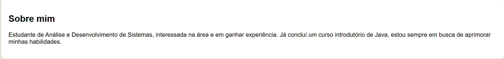
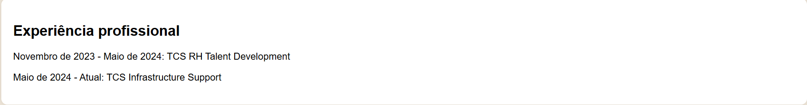
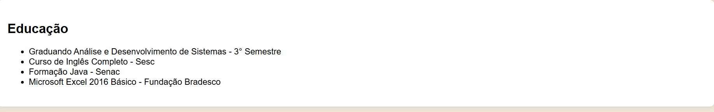
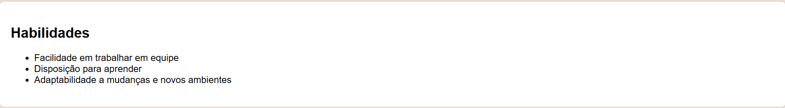
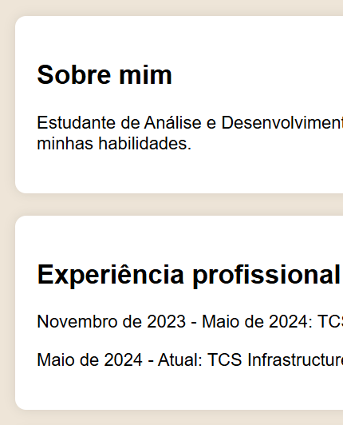

# Currículo

## Conteúdo

### Foi feita uma página simples de um currículo, utlilizando HTML e  CSS. No cabeçalho foi colocado a foto e as informações básicas, assim como o link do Linkedin e GitHub

### No corpo da página foram separadas seções descrevendo informações importantes de um currículo, sendo elas, "Sobre mim"; "Experiência profissional"; "Educação" e "Habilidades"

### Foi feito um rodapé finalizar, deixando a página mais bonita 

## Design

### Design simples para organizar as informações, a foto foi deixada em um forma circular e o cabeçalho foi destacado com a cor preta

### Para dividir as informações foram feitas "caixas" para cada seção, que também foram estilizadas

### Por fim o rodapé também foi "destacado" com um plano de fundo preto para ficar mais harmônico
